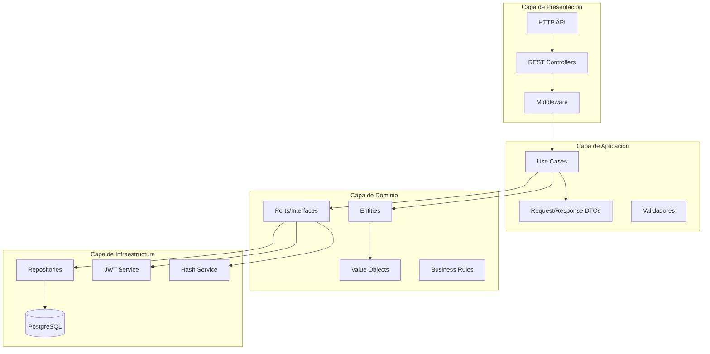
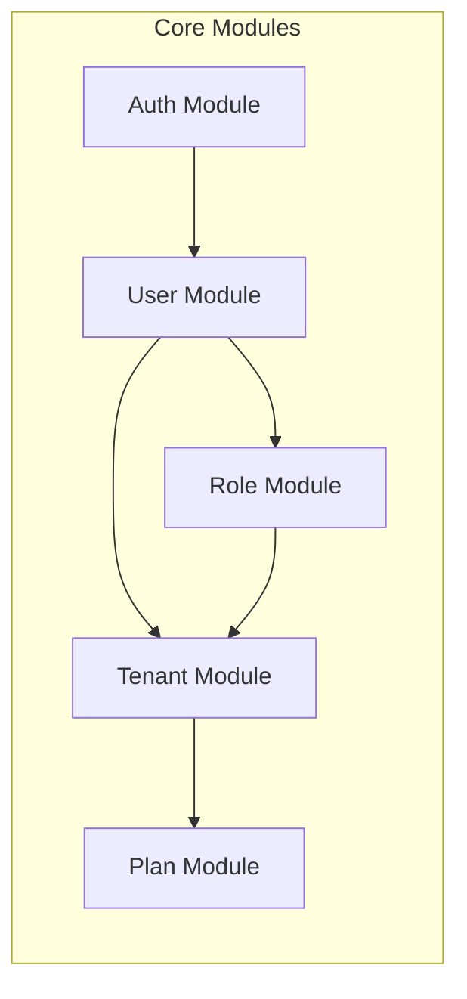
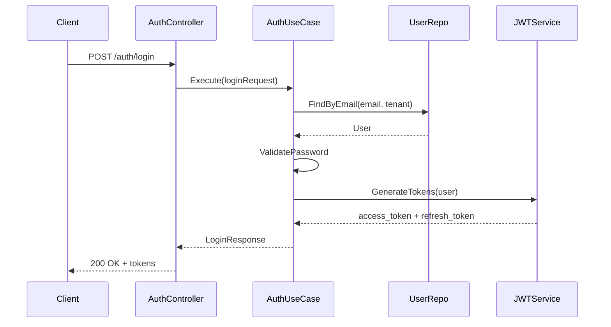
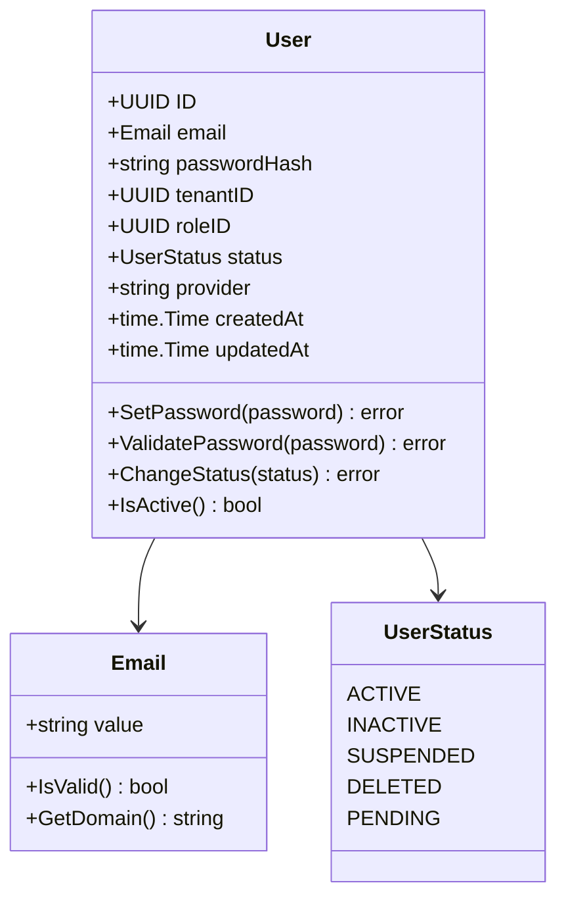
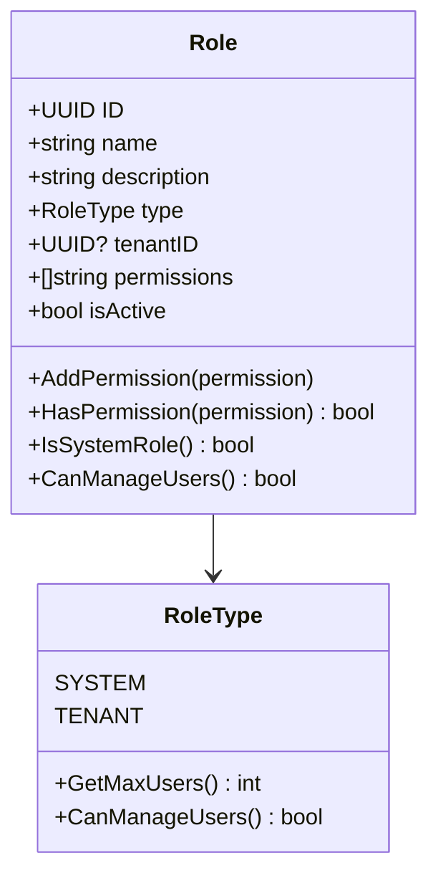
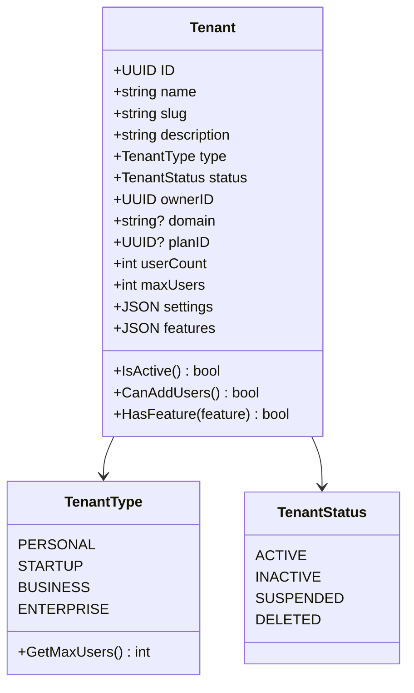
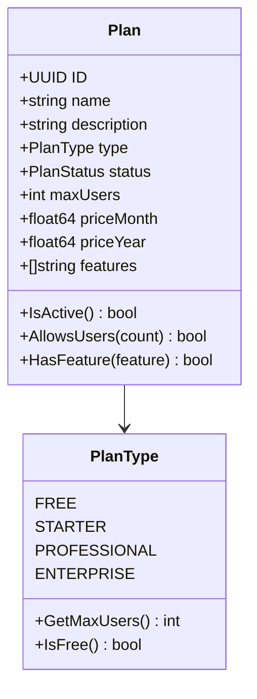
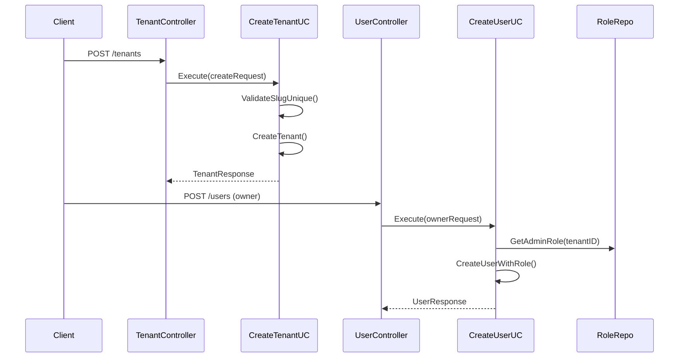
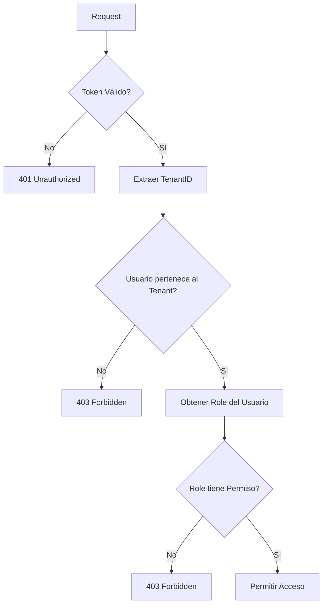
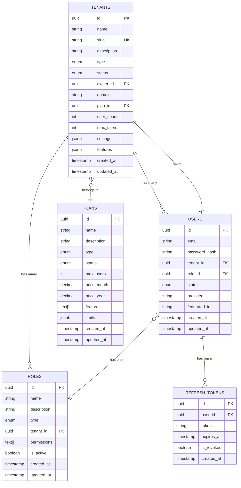

# Servicio de Gestión de Identidad y Acceso Multi-Tenant (IAM)

## 🎯 Propósito y Visión General

El **SaaS Multi-Tenant IAM Service** es un servicio de gestión de identidad y acceso diseñado para aplicaciones SaaS multi-tenant. Proporciona una solución completa para la autenticación, autorización y gestión de usuarios en un entorno donde múltiples organizaciones (tenants) comparten la misma infraestructura de aplicación.

### ¿Qué Problemas Resuelve?

1. **Aislamiento Multi-Tenant**: Garantiza que los datos y usuarios de cada organización estén completamente aislados
2. **Gestión de Identidades**: Centraliza la autenticación y autorización para múltiples aplicaciones
3. **Escalabilidad**: Maneja cientos o miles de organizaciones en una sola instancia
4. **Flexibilidad de Planes**: Permite diferentes niveles de servicio y limitaciones por tenant
5. **Gestión de Roles y Permisos**: Sistema granular de permisos adaptable a cada organización

## 🏗️ Arquitectura del Sistema

### Arquitectura Hexagonal (Clean Architecture)

El servicio está diseñado siguiendo los principios de arquitectura hexagonal, separando claramente las capas de dominio, aplicación e infraestructura.



### Módulos del Sistema



## 🧩 Componentes y Funcionalidades

### 1. Módulo de Autenticación (Auth)

**Propósito**: Gestiona el proceso de autenticación y emisión de tokens JWT.

**Funcionalidades**:
- Login con email/password (LOCAL)
- Login con Google OAuth (GOOGLE)
- Refresh de tokens
- Validación de tokens
- Logout seguro

**Flujo de Autenticación**:



### 2. Módulo de Usuarios (Users)

**Propósito**: Gestiona el ciclo de vida completo de los usuarios dentro de cada tenant.

**Funcionalidades**:
- Creación de usuarios con validación
- Actualización de perfiles
- Gestión de estados (ACTIVE, INACTIVE, SUSPENDED)
- Búsqueda y filtrado avanzado
- Eliminación soft-delete

**Entidades Principales**:



### 3. Módulo de Roles (Roles)

**Propósito**: Sistema flexible de roles y permisos que soporta tanto roles de sistema como roles específicos por tenant.

**Tipos de Roles**:
- **SYSTEM**: Roles globales (Super Admin, System Operator)
- **TENANT**: Roles específicos por organización (Admin, Manager, User)

**Funcionalidades**:
- Creación de roles con permisos granulares
- Herencia de permisos
- Roles predefinidos del sistema
- Gestión de permisos dinámicos



### 4. Módulo de Tenants (Organizaciones)

**Propósito**: Gestiona las organizaciones que utilizan el sistema, proporcionando aislamiento completo de datos.

**Tipos de Tenant**:
- **PERSONAL**: Usuarios individuales
- **STARTUP**: Pequeñas empresas
- **BUSINESS**: Empresas medianas
- **ENTERPRISE**: Grandes corporaciones

**Funcionalidades**:
- Creación con slug único
- Gestión de dominios personalizados
- Asignación de planes
- Control de límites de usuarios
- Feature flags por tenant



### 5. Módulo de Planes (Plans)

**Propósito**: Define los diferentes niveles de servicio y limitaciones que pueden tener los tenants.

**Tipos de Planes**:
- **FREE**: Plan gratuito con limitaciones básicas
- **STARTER**: Plan de inicio con funcionalidades esenciales
- **PROFESSIONAL**: Plan profesional con funcionalidades avanzadas
- **ENTERPRISE**: Plan empresarial con todas las funcionalidades



## 🔄 Flujos de Trabajo Principales

### Registro de Nueva Organización



### Gestión de Permisos Multi-Nivel



## 📊 Modelo de Datos

### Diagrama de Entidad-Relación



## 🚀 Casos de Uso Principales

### 1. Autenticación de Usuario

**Actores**: Usuario final
**Precondiciones**: Usuario registrado y activo
**Flujo Principal**:
1. Usuario envía credenciales (email/password o Google token)
2. Sistema valida credenciales
3. Sistema verifica estado del usuario y tenant
4. Sistema genera tokens JWT (access + refresh)
5. Sistema retorna tokens y datos del usuario

### 2. Creación de Organización

**Actores**: Usuario administrador
**Precondiciones**: Ninguna
**Flujo Principal**:
1. Usuario proporciona datos de la organización
2. Sistema valida unicidad del slug
3. Sistema crea tenant con plan por defecto
4. Sistema crea usuario administrador
5. Sistema asigna rol de administrador

### 3. Gestión de Usuarios por Tenant

**Actores**: Administrador del tenant
**Precondiciones**: Usuario autenticado como admin
**Flujo Principal**:
1. Admin solicita crear/modificar usuario
2. Sistema verifica permisos del admin
3. Sistema valida límites del plan del tenant
4. Sistema ejecuta operación
5. Sistema actualiza contador de usuarios

## 🛡️ Seguridad y Consideraciones

### Aislamiento Multi-Tenant

- **Row-Level Security**: Cada consulta incluye filtro por tenant_id
- **Validación de Permisos**: Doble validación a nivel de dominio y aplicación
- **Token Scoping**: Tokens JWT incluyen información del tenant

### Gestión de Tokens

- **Access Tokens**: Vida útil corta (15 minutos)
- **Refresh Tokens**: Vida útil larga (7 días) con rotación
- **Blacklisting**: Capacidad de invalidar tokens específicos

### Validaciones y Constraints

- **Email Único por Tenant**: Un email puede existir en múltiples tenants
- **Slug Único Global**: Los slugs de tenant son únicos globalmente
- **Límites de Plan**: Validación automática de límites por tenant

## 🔧 API y Integración

### Endpoints Principales

```
Auth Module:
POST   /api/v1/auth/login      - Autenticación
POST   /api/v1/auth/refresh    - Renovar token
GET    /api/v1/auth/validate   - Validar token
POST   /api/v1/auth/logout     - Cerrar sesión

User Module:
GET    /api/v1/users          - Listar usuarios (paginado)
POST   /api/v1/users          - Crear usuario
GET    /api/v1/users/:id      - Obtener usuario
PUT    /api/v1/users/:id      - Actualizar usuario
DELETE /api/v1/users/:id      - Eliminar usuario

Tenant Module:
GET    /api/v1/tenants        - Listar tenants
POST   /api/v1/tenants        - Crear tenant
GET    /api/v1/tenants/:id    - Obtener tenant
PUT    /api/v1/tenants/:id    - Actualizar tenant
DELETE /api/v1/tenants/:id    - Eliminar tenant

Role Module:
GET    /api/v1/roles          - Listar roles
POST   /api/v1/roles          - Crear rol
GET    /api/v1/roles/:id      - Obtener rol
PUT    /api/v1/roles/:id      - Actualizar rol
DELETE /api/v1/roles/:id      - Eliminar rol

Plan Module:
GET    /api/v1/plans          - Listar planes (público)
POST   /api/v1/plans          - Crear plan (admin)
GET    /api/v1/plans/:id      - Obtener plan
```

### Filtros y Paginación

Todos los endpoints de listado soportan:
- **Paginación**: `page`, `page_size`
- **Ordenamiento**: `sort_by`, `sort_dir`
- **Filtros específicos**: Por cada módulo

### Autenticación y Autorización

- **Bearer Token**: Requerido en header Authorization
- **Tenant Context**: Header X-Tenant-ID (opcional, se extrae del token)
- **Role-based Access**: Validación automática de permisos

## 📈 Escalabilidad y Rendimiento

### Optimizaciones de Base de Datos

- **Índices Compuestos**: tenant_id + campo_consulta
- **Particionamiento**: Por tenant para tablas grandes
- **Connection Pooling**: Gestión eficiente de conexiones

### Caching Estratégico

- **Token Validation**: Cache de tokens válidos
- **Role Permissions**: Cache de permisos por rol
- **Tenant Settings**: Cache de configuraciones por tenant

### Monitoreo y Métricas

- **Health Checks**: Endpoint /health para monitoreo
- **Métricas de Negocio**: Usuarios por tenant, uso de planes
- **Performance**: Tiempo de respuesta por endpoint

## 🚀 Despliegue y Configuración

### Variables de Entorno

```bash
# Base de Datos
DB_HOST=localhost
DB_PORT=5432
DB_NAME=iam_service
DB_USER=postgres
DB_PASSWORD=password

# JWT
JWT_SECRET=your-jwt-secret
JWT_ACCESS_EXPIRES=15m
JWT_REFRESH_EXPIRES=7d

# Servidor
PORT=8080
GIN_MODE=release

# Google OAuth (opcional)
GOOGLE_CLIENT_ID=your-google-client-id
```

### Docker Compose

```yaml
version: '3.8'
services:
  iam-service:
    build: .
    ports:
      - "8080:8080"
    environment:
      - DB_HOST=postgres
      - DB_NAME=iam_service
    depends_on:
      - postgres
      
  postgres:
    image: postgres:15
    environment:
      POSTGRES_DB: iam_service
      POSTGRES_PASSWORD: password
    volumes:
      - postgres_data:/var/lib/postgresql/data
```

## 🔄 Roadmap y Futuras Mejoras

### Versión Actual (v1.0)
- ✅ Autenticación JWT multi-tenant
- ✅ Gestión de usuarios, roles y tenants
- ✅ Sistema de planes y límites
- ✅ API REST completa con filtros

### Próximas Versiones

**v1.1 - Seguridad Avanzada**
- 🔜 Autenticación de dos factores (2FA)
- 🔜 Single Sign-On (SSO) con SAML
- 🔜 Audit logs detallados

**v1.2 - Funcionalidades Avanzadas**
- 🔜 Webhooks para eventos de usuarios
- 🔜 API de migración entre tenants
- 🔜 Dashboard de administración

**v1.3 - Integración y Escalabilidad**
- 🔜 Soporte para múltiples bases de datos
- 🔜 Message queues para operaciones async
- 🔜 Microservicios distribuidos

---

**Documentación técnica adicional**:
- [Guía de Integración API](../documentation/API_INTEGRATION.md)
- [Especificación OpenAPI](../api-docs/openapi.yaml)
- [Migraciones de Base de Datos](../migrations/)

**Desarrollado con ❤️ usando Go + Arquitectura Hexagonal**
